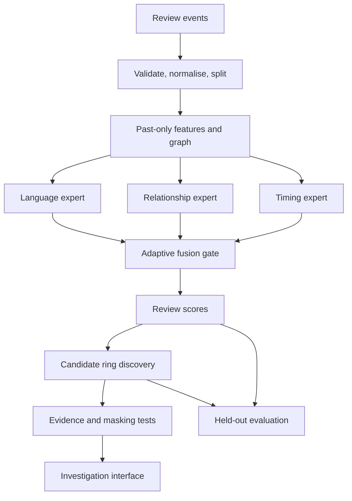

# ReviewRing AI

## Complete implementation and research guide

**Adaptive graph–language learning for coordinated review manipulation detection and evidence-based investigation**

Prepared: 16 September 2026. Intended for a student AI/ML + Business Intelligence and Analytics project using Python, Jupyter, and an optional Streamlit investigation interface. Power BI is not required.

> **Document status:** This is a development specification, not an already implemented or trained software repository. Module names, CLI commands, configuration files, and API routes marked **planned** are contracts to implement. Dependency installation and short data-inspection examples are provided separately. No accuracy, runtime, model reproduction, dataset download, or dependency compatibility result is claimed to have been measured for this project. Numerical hyperparameters are starting choices, not findings from the referenced papers.

## Contents

1. [Project objective and scope](#1-project-objective-and-scope)
2. [Research foundations and contribution](#2-research-foundations-and-contribution)
3. [Prerequisites, hardware, and costs](#3-prerequisites-hardware-and-costs)
4. [Dependencies and environment](#4-dependencies-and-environment)
5. [Dataset selection and access](#5-dataset-selection-and-access)
6. [Dataset formats and ingestion](#6-dataset-formats-and-ingestion)
7. [Canonical project schemas](#7-canonical-project-schemas)
8. [Architecture and interfaces](#8-architecture-and-interfaces)
9. [Splitting and leakage prevention](#9-splitting-and-leakage-prevention)
10. [Features and graph construction](#10-features-and-graph-construction)
11. [Models, losses, and training](#11-models-losses-and-training)
12. [Simulation and robustness experiments](#12-simulation-and-robustness-experiments)
13. [Ring discovery and prioritisation](#13-ring-discovery-and-prioritisation)
14. [Evidence and counterfactual explanations](#14-evidence-and-counterfactual-explanations)
15. [Evaluation and experiment design](#15-evaluation-and-experiment-design)
16. [Repository layout and module contracts](#16-repository-layout-and-module-contracts)
17. [Configuration and planned commands](#17-configuration-and-planned-commands)
18. [Application, API, and demonstration](#18-application-api-and-demonstration)
19. [Testing and reproducibility](#19-testing-and-reproducibility)
20. [Development roadmap](#20-development-roadmap)
21. [Problems and mitigations](#21-problems-and-mitigations)
22. [Deployment and operational boundaries](#22-deployment-and-operational-boundaries)
23. [Deliverables and completion criteria](#23-deliverables-and-completion-criteria)
24. [References and reading order](#24-references-and-reading-order)
25. [Glossary and first working session](#25-glossary-and-first-working-session)

## 1. Project objective and scope

### 1.1 Problem

A review may sound believable in isolation while its author repeatedly acts alongside other accounts. ReviewRing analyses text, account relationships, and activity timing to rank suspicious review groups for investigation. Its business purpose is to help a moderator use a limited investigation budget effectively and understand which review activity may distort a product's reputation.

The model predicts an investigation score. It does not establish identity, intent, payment, or fraud as a fact. Positive sentiment, AI-assisted writing, a verified-purchase flag, or a shared target alone does not establish manipulation.

### 1.2 Inputs and outputs

**Full input:** review text, reviewer ID, target/product ID, rating, timestamp; optionally product metadata. Product and business IDs occupy the same abstract role, `target_id`. Do not mix distinct platforms' IDs without a source namespace.

**Outputs:**

- Review-level scores and per-expert scores.
- Candidate rings with members, affected targets, and supporting events.
- An investigation queue ranked by a documented heuristic.
- Evidence cards with source review IDs, relation types, and observed time windows.
- Counterfactual score changes when selected evidence is masked.
- Offline evaluation reports and robustness curves.

A lone pasted review can receive a text-only score. It cannot support a coordination claim without historical relationships. Return `insufficient_context` for ring analysis in that case.

### 1.3 Three implementation levels

| Level | Build | Completion condition |
|---|---|---|
| A: minimum working research baseline | CARE-GNN Yelp benchmark adapter, feature baseline, graph baseline, graph viewer | Reproducible scores on saved masks, no text/timeline claims |
| B: principal contribution | Raw-review pipeline, language/graph/time experts, adaptive gate, controlled campaigns | Comparison with fixed fusion on held-out campaigns and later events |
| C: investigation prototype | Candidate-ring grouping, evidence cards, counterfactual tests, replay interface | A reviewer can trace an alert to actual records and inspect changes |

Complete A before B. Use C to explain measured behaviour. Full reimplementations of four papers, continuous-time transformers, production streaming infrastructure, and a large generative model are not prerequisites.

### 1.4 What makes the project research-oriented

**Primary hypothesis:** Adaptive evidence fusion improves detection under selected camouflage conditions compared with individual experts and fixed fusion, at the same investigation budget.

**Secondary hypothesis:** Small evidence subgraphs preserve model scores better than random equally sized subgraphs and cause a larger score reduction when removed.

Both may be rejected by experiments. A negative result with sound controls is more useful than an unsupported novelty claim.

## 2. Research foundations and contribution

| Reference | Relevant idea | Planned use | Boundary |
|---|---|---|---|
| [FraudSquad, 2025](https://arxiv.org/abs/2510.01801) | Language embeddings plus a gated graph transformer for review spam | Baseline concept for combining review meaning and network information | MiniLM + GraphSAGE in this guide is an engineering baseline, not an exact reproduction |
| [CAMERA, 2026](https://arxiv.org/html/2605.20032v1) | Adaptive specialised experts for semantic camouflage in unsupervised text-attributed graph detection | Motivation for a small gate that chooses among evidence sources | Our main training plan is supervised; CAMERA's one-class objectives are not reproduced |
| [SCFCRC, 2025](https://arxiv.org/abs/2501.12430) | Feature and relation camouflage, contrastive learning, relation experts | Robustness comparison and optional consistency experiment | Generic augmentation is not equivalent to its full method |
| [CF3, 2025](https://arxiv.org/abs/2503.06441) | Factual/counterfactual evidence subgraphs for company financial risk | Motivation for retention/removal explanation tests | Review graphs differ from its company graphs; masking does not prove causation |
| [CARE-GNN, CIKM 2020](https://arxiv.org/abs/2008.08692) | Camouflage-aware multi-relation graph detection | Established baseline and processed datasets | Earlier foundational work, not a recent breakthrough |

The proposed additions are a shared review-level data contract, an explicit time expert, a modality-aware gate, campaign-level evaluation, and moderator-facing evidence. These are design choices to test, not claims that the combination is unprecedented. Search closely related work again before writing a publication novelty claim.

For exact paper comparisons: read the full paper, record its version, inspect the authors' code and license, match preprocessing/splits, and reproduce its baseline first. Label every result `reproduction`, `adaptation`, or `new baseline` appropriately. Treat linked arXiv versions as preprints unless a publication venue is independently confirmed.

## 3. Prerequisites, hardware, and costs

### 3.1 Knowledge required

- Python functions/classes, NumPy/pandas, virtual environments, Git.
- Classification, train/validation/test splits, precision/recall, class imbalance.
- PyTorch tensors, losses, optimisers, checkpoints.
- Graph nodes/edges, message passing, relation types, neighbourhood sampling.
- Text embeddings and cosine similarity.
- SQL joins/grouping and timestamp handling.

Learn these through the baseline before adding the gate. Advanced causal inference is not needed because the explanation component only analyses model responses.

### 3.2 Resource planning estimates

| Resource | Minimum development | Recommended research setup |
|---|---|---|
| CPU | Modern 4-core machine | 8 or more cores |
| RAM | 16 GB for bounded subsets | 32 GB for larger sparse graphs |
| GPU | Optional for data inspection and linear models | NVIDIA GPU with roughly 12–16 GB VRAM for small sampled GNNs |
| Disk | Reserve about 10–20 GB for initial subset work | 30–50 GB if keeping multiple datasets and checkpoints |
| OS | Linux, macOS, or Windows | Linux/WSL2 simplifies CUDA and graph-package setup |
| Internet | Initial datasets, packages, model weights | Optional after caches are prepared |

These are planning estimates, not hardware guarantees. Profile a 5,000-review run before scaling. CARE-GNN graphs may be dense in edges despite modest node counts. Avoid dense adjacency matrices.

For 100,000 reviews, 384-dimensional float32 embeddings alone use approximately 154 MB (146 MiB). A 100,000-by-100,000 float32 similarity matrix requires about 40 GB before overhead: never construct it. Directed int64 edge indices need approximately 16 bytes per edge before attributes and training activations.

A paid API is unnecessary. Pretrained local embeddings, deterministic templates, and cached offline simulations are enough. If an optional LLM paraphraser is used, measure token usage and set a fixed generation budget; actual cost depends on the chosen provider and model. Free hosted GPU quotas and runtimes are not guaranteed.

## 4. Dependencies and environment

### 4.1 Package roles

| Package | Role | Required stage |
|---|---|---|
| `numpy`, `scipy` | Arrays, MATLAB data, sparse adjacency | A |
| `pandas`, `pyarrow` | Normalised tables and Parquet | A/B |
| `scikit-learn` | Linear baselines, scaling, metrics, calibration | A |
| `torch` | Neural models | A |
| `torch-geometric` | Graph layers and data structures | A |
| `sentence-transformers` | Frozen text embeddings | B |
| `networkx` | Small investigation subgraphs and community algorithms | C |
| `duckdb` | Local analytical SQL over Parquet | B |
| `pyyaml`, `pydantic`, `tqdm` | Configuration, validation, progress | A/B |
| `matplotlib`, `plotly` | Research figures and interactive plots | A/C |
| `streamlit`, `pyvis` | Investigation interface | C |
| `jupyterlab`, `ipykernel` | Development notebooks | A |
| `pytest`, `ruff` | Targeted tests and linting | A |
| `fastapi`, `uvicorn` | Optional separate service | Deployment only |
| `faiss-cpu` | Optional large approximate-neighbour index | Scale only |
| `safetensors` | Optional portable tensor-weight format | Packaging |

Keep DGL out of the main environment unless reproducing a DGL implementation. Its documentation is useful for schema verification without installing it. Avoid adding graph extensions, vector databases, orchestration frameworks, or distributed queues until a measured need exists.

### 4.2 Installation approach

Use Python 3.11 as an initial target, subject to the supported versions of the package releases you select. Create a fresh environment. This is a bootstrap procedure, not a tested lockfile.

```bash
python3.11 -m venv .venv
source .venv/bin/activate
python -m pip install --upgrade pip
```

Windows PowerShell activation: `.venv\Scripts\Activate.ps1`. Use `py -3.11 -m venv .venv` if that is how Python is installed.

Install PyTorch using the command generated by the official [PyTorch selector](https://pytorch.org/get-started/locally/) for your OS and CPU/CUDA configuration. On a Linux/Windows CPU-only setup, the standard CPU index route is:

```bash
python -m pip install torch --index-url https://download.pytorch.org/whl/cpu
```

For macOS or CUDA, use the selector rather than copying that CPU command. Then:

```bash
python -m pip install torch-geometric
python -m pip install numpy scipy pandas pyarrow scikit-learn
python -m pip install sentence-transformers networkx duckdb pyyaml pydantic tqdm
python -m pip install matplotlib plotly streamlit pyvis jupyterlab ipykernel
python -m pip install pytest ruff
python -m pip check
```

PyG can be installed with a minimal package set; some sampling operations need optional compiled extensions. Follow the current [PyG installation instructions](https://pytorch-geometric.readthedocs.io/en/latest/install/installation.html) and match the installed Torch/CUDA versions exactly. Start on small pre-extracted subgraphs if sampling extensions fail. Sentence Transformers has its own [installation guidance](https://www.sbert.net/docs/installation.html).

Run a smoke check:

```python
import torch
import torch_geometric
from torch_geometric.nn import SAGEConv

x = torch.randn(4, 8)
edge_index = torch.tensor([[0, 1, 2], [1, 2, 3]], dtype=torch.long)
y = SAGEConv(8, 16)(x, edge_index)
assert y.shape == (4, 16)
print(torch.__version__, torch_geometric.__version__)
print("CUDA available:", torch.cuda.is_available())
```

After a successful small end-to-end training run, freeze and commit the working environment:

```bash
python -m pip freeze > requirements.lock.txt
python -m pip check
```

Also record Python, OS, GPU driver, `torch.version.cuda`, model revision, and install commands in `environment.md`. A CPU and CUDA setup may need separate locks. `pip freeze` alone does not capture drivers or reproduce the package index choice. Do not call an untested dependency list a reproducible environment.

### 4.3 Development dependency file

Create a `requirements.in` containing the packages above, excluding the separately selected Torch build and optional packages. Resolve exact versions once in a clean environment; commit that lock. Use `python -m pip install -r requirements.lock.txt` only for a compatible platform and after verifying the original Torch installation route.

No private API keys are required for the core project. Keep optional credentials in environment variables and out of notebooks, screenshots, and Git.

## 5. Dataset selection and access

### 5.1 Two-track strategy

**Track A: labelled static graph benchmark.** Use CARE-GNN YelpChi first. This establishes whether the graph pipeline works on established benchmark labels.

**Track B: raw-review temporal prototype.** Use a bounded Amazon Reviews 2023 category, with controlled planted campaigns for known membership and replay. Original background activity remains unlabelled.

These are different tasks and models. Do not transfer node IDs, label meanings, feature columns, or a trained classifier between tracks without an explicit adapter and a new evaluation. A successful static benchmark does not validate live ring detection.

### 5.2 Sources and limitations

| Source | Access | Use | Limitation |
|---|---|---|---|
| [CARE-GNN repository](https://github.com/YingtongDou/CARE-GNN) | Includes `data/YelpChi.zip` and `data/Amazon.zip` | Static feature/graph classification | Processed matrices are not the original event records |
| [Original YelpCHI](https://shebuti.com/yelpchi-dataset/) | Official page asks for email access | Text + ratings + time + identities, if obtained | Access is not an immediate-download dependency; labels approximate Yelp's filtering |
| [Amazon Reviews 2023](https://amazon-reviews-2023.github.io/) | Category-level review/metadata links | Full pipeline and simulation background | No supplied verified spam-ring labels |
| [Amazon dataset card](https://huggingface.co/datasets/McAuley-Lab/Amazon-Reviews-2023) | Additional distribution/documentation | Schema and provenance checks | Historical loader examples may rely on dataset scripts |
| [FraudSquad release linked by paper](https://anonymous.4open.science/r/FraudSquad-5389/) | Paper states code/data are released | Optional generated-spam evaluation | Download was not verified during preparation; not required to finish |

Original YelpCHI is described as 67,395 reviews from 201 businesses and 38,063 reviewers, with text and metadata. This is not the same-sized object as the processed CARE-GNN Yelp graph. The official access request and approximate labels are documented on the [author's dataset page](https://shebuti.com/yelpchi-dataset/).

### 5.3 Suggested Amazon categories

Start with **Subscription_Boxes** for ingestion and replay; the source lists approximately 16.2 thousand ratings. If its graph is too sparse for meaningful group analysis, use **All_Beauty**, listed at approximately 701.5 thousand, and select a bounded time period and product cohort. These counts are category-scale guidance, not promised post-cleaning counts. [Official category list](https://amazon-reviews-2023.github.io/)

Choose the cohort before evaluating outcomes. Keep all events within the selected target/time boundaries, retain prior reviewer context where feasible, and measure how much history is lost. Random row sampling destroys coordination and must not be your only sampling method.

Do not download the complete corpus for a first prototype. Use the official category links, log the actual downloaded filenames, hash every archive, and preserve the source revision/date. If a download fails, use the official dataset file listing or proceed with Track A; do not silently substitute an unrelated Kaggle upload.

### 5.4 Acquisition of the static benchmark

Commands below acquire an external reference repository; they do not train ReviewRing:

```bash
git clone https://github.com/YingtongDou/CARE-GNN.git external/CARE-GNN
git -C external/CARE-GNN rev-parse HEAD
mkdir -p data/raw/care
python -m zipfile -e external/CARE-GNN/data/YelpChi.zip data/raw/care
python -m zipfile -e external/CARE-GNN/data/Amazon.zip data/raw/care
```

Inspect the archive member layout before configuring the final `.mat` paths. Save the returned commit SHA. Keep any original-paper runtime in an isolated environment; do not overwrite your modern project environment with its old requirements. The authors' README also documents corrections to some original results, so read those before reproducing comparisons. [CARE-GNN README](https://github.com/YingtongDou/CARE-GNN)

## 6. Dataset formats and ingestion

### 6.1 Processed graph schema

The reference files use MATLAB matrices, not CSV records.

| File | Node meaning | Feature/label keys | Relation keys |
|---|---|---|---|
| `YelpChi.mat` | Review | `features`, `label` | `net_rur`, `net_rtr`, `net_rsr` |
| `Amazon.mat` | Reviewer/user | `features`, `label` | `net_upu`, `net_usu`, `net_uvu` |

Expected Yelp benchmark dimensions: 45,954 nodes and 32 features. Yelp relations describe common author, common target/month, and common target/star rating. `homo` may also be present as a combined graph. Adjacency is sparse; labels may have an extra singleton dimension. For the reference Amazon ordering, indices 0–3304 are unlabelled and must be excluded from supervised loss and label metrics. Verify this ordering before applying the rule to any other export. [DGL reference adapter and schema](https://www.dgl.ai/dgl_docs/_modules/dgl/data/fraud.html)

Inspect the actual file rather than hard-coding assumptions:

```python
from pathlib import Path
import numpy as np
from scipy.io import loadmat
from scipy import sparse

path = Path("data/raw/care/YelpChi.mat")  # adjust to archive layout
mat = loadmat(path)
for key, value in mat.items():
    if not key.startswith("__"):
        print(key, getattr(value, "shape", None), type(value).__name__)

features = mat["features"]
labels = np.asarray(mat["label"]).reshape(-1)
assert features.shape[0] == len(labels)
for key in ("net_rur", "net_rtr", "net_rsr"):
    adjacency = mat[key]
    assert sparse.issparse(adjacency)
    assert adjacency.shape == (len(labels), len(labels))
    print(key, adjacency.nnz)
print(np.unique(labels, return_counts=True))
```

Convert each sparse relation to COO and construct `[2, E]` int64 edge indices. Preserve relation identity; do not concatenate duplicate edges without deciding how multiple relation types are represented. Make features float32 only after checking memory. Store labels outside `x` and pass them only to loss/metrics.

Track A must display relation explanations at the level supported by the matrices. Do not invent exact review text, user handles, dates, or businesses from matrix row numbers.

### 6.2 Amazon raw fields and mapping

Use raw review JSONL, possibly compressed as `.gz`; each line is a JSON object. Normalise only fields actually present in the downloaded release.

| Source field | Canonical field | Handling |
|---|---|---|
| `user_id` | `reviewer_id` | Namespace with source |
| `parent_asin` | `target_id` | Parent-product identifier for metadata joins |
| `asin` | `variant_id` | Keep separately |
| `title`, `text` | `title`, `text` | Preserve raw strings |
| `rating` | `rating` | Validate range |
| `timestamp` / `sort_timestamp` | `timestamp` | Inspect release and explicitly configure units |
| `verified_purchase` | `verified_purchase` | Optional; not a fraud label |
| `helpful_vote` / `helpful_votes` | `helpful_votes` | Snapshot field; exclude from causal-time inputs |
| `images` | optional raw metadata | Outside the initial model |

The official examples and field tables show some naming differences; reject conflicts rather than silently selecting a field. Metadata joins use `parent_asin`; available descriptions, category, and product title may support the UI. [Dataset fields](https://amazon-reviews-2023.github.io/) and [dataset card](https://huggingface.co/datasets/McAuley-Lab/Amazon-Reviews-2023).

Do not use metadata's crawl-time average rating, rating count, helpful votes, or current price as if known at historical prediction time. The safest initial model omits all mutable snapshot metadata. Even product descriptions require version-time caution; keep them for display unless their availability is established.

### 6.3 Streaming inspection without custom dataset scripts

Download one official category file and set its local path:

```python
from pathlib import Path
import gzip
import json

path = Path("data/raw/amazon/Subscription_Boxes.jsonl.gz")
open_text = gzip.open if path.suffix == ".gz" else open
with open_text(path, "rt", encoding="utf-8") as stream:
    for row_number, line in enumerate(stream):
        row = json.loads(line)
        if row_number < 3:
            print(sorted(row.keys()))
            print(row.get("timestamp", row.get("sort_timestamp")))
        if row_number == 99:
            break
```

Use the actual extension; do not merely rename compressed bytes. Stream batches into Parquet with a fixed Arrow schema. Log malformed records to a quarantine table with reason and source line. Compare read, accepted, duplicate, and rejected counts; they must reconcile.

Avoid depending on historical `trust_remote_code=True` examples. Native JSON parsing is sufficient and avoids executing a dataset loader. Record timestamp units explicitly after inspection; millisecond values are common, but verify magnitude, source documentation, and resulting dates.

### 6.4 Labels and licence provenance

Create a data card per source with URL, access date, revision/hash, row counts, missingness, label meaning, exclusion rules, and usage/redistribution terms. Public access is not automatically a permissive data license; a repository's code license does not necessarily license its underlying reviews. Do not redistribute raw datasets inside your project until their terms allow it.

Use three label states: `1 = positive under the named label source`, `0 = negative under the named label source`, `null = unknown`. Distinguish benchmark proxy labels, synthetic manipulation labels, controlled legitimate examples, and human annotations. Never convert all unknown Amazon reviews to verified negatives.

## 7. Canonical project schemas

The schemas in this section are **proposed project interfaces**, not original dataset formats. Keep raw data immutable and write derived versions separately.

### 7.1 `reviews.parquet`

| Column | Type | Required | Meaning |
|---|---|---|---|
| `review_id` | string | Yes | Stable namespaced identifier |
| `reviewer_id` | string | Yes for graph | Namespaced source user ID |
| `target_id` | string | Yes for graph | Parent product or business |
| `variant_id` | string/null | No | Product variant |
| `timestamp` | UTC datetime | Yes for temporal | Event time |
| `title` | string | No | Empty allowed |
| `text` | string | No | Empty allowed; set missing flag |
| `rating` | float | Yes for rating features | Range 1–5 where appropriate |
| `source` | string | Yes | Dataset/platform namespace |
| `source_row` | integer | Yes | Original line number for audit |
| `source_file_hash` | string | Yes | Byte-level provenance |
| `verified_purchase` | boolean/null | No | Kept separate from label |

When no review ID exists, derive it from source revision, file hash, and line number. Compute a separate content fingerprint for deduplication. Two identical texts are not necessarily duplicate events; deduplicate only exact record duplicates under a declared rule. Preserve IDs across deterministic reprocessing.

### 7.2 `labels.parquet` — not a model input

| Column | Type | Meaning |
|---|---|---|
| `review_id` or `node_id` | string/int | Foreign key to prediction unit |
| `label` | nullable integer | 0, 1, or unknown |
| `label_source` | enum | `benchmark_proxy`, `synthetic`, `human`, `unknown` |
| `label_available_at` | UTC datetime/null | When supervision became available, if known |
| `campaign_id` | string/null | Ground-truth simulated membership, evaluation only |
| `scenario_family` | string/null | Simulation split control, evaluation only |
| `is_synthetic` | boolean | Audit only |

Do not expose any of these fields to feature generation except the supervised training target on eligible training rows. Campaign IDs, generated-ID prefixes, file ordering, and label provenance are common accidental shortcuts.

### 7.3 Other artifacts

| Artifact | Required contents |
|---|---|
| `node_map.parquet` | `node_idx`, `review_id`; deterministic order and unique mapping |
| `splits.parquet` | ID, role (`train`, `validation`, `calibration`, `test`), cutoff, protocol |
| `features.parquet` | ID, feature values, missingness flags, `as_of`, schema version |
| `embeddings.npy` | Float32 matrix `[N, d]`, saved with matching node map |
| `edges.parquet` | `src`, `dst`, relation, weight, `available_at`, evidence reference |
| `edge_evidence.parquet` | Relation IDs, source review IDs, windows, measured similarity/overlap |
| `predictions.parquet` | ID, raw score, calibrated score if valid, expert scores, gate weights, model version, `as_of` |
| `campaigns.parquet` | Synthetic campaign design, member IDs, time bounds, split, seed; evaluator only |
| `rings.parquet` | Candidate ID, members, targets, score, discovery time, status |
| `evidence.jsonl` | One structured investigation card per candidate |
| `manifest.json` | Hashes, schema versions, source/license references, configuration, revisions |

Enforce one-to-one joins for embeddings and predictions; fail on duplicate IDs, missing mappings, or a row count mismatch. Unknown labels can exist in graph context but must not enter supervised loss or labelled metrics.

### 7.4 Synthetic example event

```json
{
  "review_id": "demo:r0001",
  "reviewer_id": "demo:u007",
  "target_id": "demo:p019",
  "variant_id": null,
  "timestamp": "2023-07-10T10:30:00Z",
  "title": "Useful product",
  "text": "The item worked well for my needs.",
  "rating": 5.0,
  "source": "demo",
  "source_row": 1,
  "source_file_hash": "record-the-actual-sha256",
  "verified_purchase": null
}
```

This is invented fixture data, not a source-dataset record. Real fixtures should store their actual provenance hash.

## 8. Architecture and interfaces

### 8.1 Planned full-system architecture



The static benchmark bypasses language/timing modules when inputs are unavailable. It uses its own feature schema and checkpoint.

### 8.2 Layers

1. **Data layer:** adapters, schema checks, immutable raw files, DuckDB/Parquet.
2. **Representation layer:** cached text embeddings, time-correct features, sparse relations.
3. **Prediction layer:** expert networks, gate, score calibration, missing-input fallback.
4. **Investigation layer:** candidate grouping, evidence computation, masking analysis.
5. **Presentation layer:** Streamlit; optional FastAPI only when a separate client is needed.
6. **Experiment layer:** fixed splits, model variants, stress scenarios, metrics, manifests.

Do not put data preparation or training directly inside Streamlit callbacks. The application loads versioned artifacts and calls inference functions.

### 8.3 Core function contracts

```python
# Planned interfaces; implement the referenced types and bodies in the repository.
def normalise_reviews(raw_path, schema_config):
    """Return canonical records, quarantine records, and an audit summary."""
    raise NotImplementedError


def build_snapshot(reviews, cutoff, graph_config, fitted_preprocessor):
    """Return only context available by cutoff plus feature/edge provenance."""
    raise NotImplementedError


def score_reviews(snapshot, model_bundle):
    """Return IDs, raw scores, available expert scores, and gate weights."""
    raise NotImplementedError


def discover_rings(predictions, event_context, ring_config):
    """Return candidates using observed relationships, not test labels."""
    raise NotImplementedError


def explain_candidate(candidate, snapshot, model_bundle, budget):
    """Return verified evidence and reproducible masking results."""
    raise NotImplementedError
```

Every function must identify its schema version, cutoff semantics, and deterministic seed where needed. Prediction should never depend on evaluator-only campaign membership.

## 9. Splitting and leakage prevention

### 9.1 Track A: static benchmark protocol

Use a fixed stratified split of eligible labelled nodes, for example 60% train, 15% validation, 10% calibration, 15% test. Save exact node indices and seed. For a reproduction, use the paper's actual protocol instead and report differences.

A transductive graph may include test-node features and edges while hiding their labels. State this explicitly. Preprocessed graphs can encode relations formed over the entire source period; therefore do not describe this result as prediction of future events.

Train feature scalers only on train rows. Use only train labels in any label propagation or neighbour filtering. Unknown Amazon nodes can remain context but are excluded from loss, calibration, and metrics. Do not assume a stored zero is an observed negative when the reference mask says unlabelled.

### 9.2 Track B: chronological protocol

1. Select time boundaries without looking at outcomes; begin with approximate 60/15/10/15 chronological proportions.
2. Ensure each labelled partition contains both classes; adjust using the simulator plan before model evaluation.
3. Keep campaigns and their rewritten variants entirely within one partition. Prevent source-text near-duplicates crossing partitions.
4. Use only prior events to compute history at each target event. Fit scalers and any learned preprocessing on training examples.
5. Use validation for architecture/threshold decisions; calibration for post-hoc probability calibration; test once after freezing the design.
6. Hold out at least one simulation mechanism and, if possible, a paraphrasing model or prompt family.
7. Add an optional reviewer-disjoint test as a separate cold-start experiment. It may be smaller and should not replace the chronological result.

Training simulations must never use future test reviews or descriptions as generation references. Treat generated variants as one family during splitting.

### 9.3 Exact time semantics

For event `i` at `t_i`, the current review text/rating is available, but reviewer and product history should ordinarily use events strictly before `t_i`. For equal timestamps, either process them as one batch with shared prior state or use a documented stable order. Do not let arbitrary file order give some tied events future information.

Every edge carries `available_at`: the earliest time its evidence can be known. Restrict both direct and multi-hop paths to the inference cutoff. Removing test labels alone does not prevent temporal leakage.

A simple causal graph design directs historical source reviews toward later destination reviews. Build edge attributes using only evidence known when the destination arrived. With two graph layers, ensure both hops follow this direction. A live event must not receive a message influenced by an event that occurs later.

For daily replay, score after that day's batch and report daily resolution. Do not describe the results as instant event-time detection. For per-event replay, update context and score each event under the stricter policy above.

### 9.4 Common leakage sources to exclude

- Yelp filter status as an input when predicting the same status.
- Ground-truth ring IDs and synthetic provenance.
- Lifetime activity counts computed from the full dataset.
- Final product ratings and accumulated helpful-vote counts.
- Semantic neighbours drawn from future reviews.
- Scaling, feature selection, or early stopping on test data.
- Community features computed using future edges.
- Prompt templates, generated-ID patterns, or duplicate text shared across splits.

## 10. Features and graph construction

### 10.1 Text representation

Start with the frozen [all-MiniLM-L6-v2 model](https://huggingface.co/sentence-transformers/all-MiniLM-L6-v2). Its model card describes 384-dimensional sentence/paragraph embeddings and truncation beyond 256 word pieces. It is a compact engineering choice, not the exact encoder prescribed by every paper.

Concatenate title and body with a separator. Preserve negation and punctuation. Do not stem or remove stop words for transformer embeddings. Store the raw text separately; HTML cleanup must not alter meaning. Record empty-text and truncation flags. Long reviews can later be chunked and mean-pooled, but compare that change fairly.

```python
import numpy as np
from sentence_transformers import SentenceTransformer

encoder = SentenceTransformer("sentence-transformers/all-MiniLM-L6-v2")
texts = ["Good packaging. The item arrived as described.", "Delivery was slow."]
vectors = encoder.encode(
    texts,
    batch_size=32,
    normalize_embeddings=True,
    convert_to_numpy=True,
)
assert vectors.shape == (2, 384)
np.save("example_embeddings.npy", vectors.astype("float32"))
```

For research runs, pin the model revision and cache vectors by `(review_id, text_hash, model_revision, preprocessing_version)`. Recompute after paraphrasing. Start with English text; measure out-of-language frequency and route unsupported text appropriately. Do not claim multilingual robustness from an English-only evaluation.

### 10.2 Numerical feature inventory

**Timing expert candidates:** prior reviewer counts over 1/7/30 days; time since previous review; prior unique targets; current-target review volume; reviewer interarrival variation; rating changes relative to prior history; same-target burst intensity. Use `log1p` for long-tailed counts and train-fitted robust scaling where useful.

**Relationship expert candidates:** prior degree by relation, repeated target overlap, distinct co-reviewers, normalised overlap, and graph embeddings. If raw text is also used as graph input, label the baseline `graph + text features`; do not call it a behaviour-only graph baseline.

**Language expert:** text embedding to a small MLP. A TF-IDF + logistic regression baseline is useful where labels and text align.

Missing history must have a missingness indicator. A new account is not equivalent to a suspicious account. `first_seen_in_dataset` is not actual account creation time.

### 10.3 Sparse review graph: recommended initial design

Use reviews as nodes in Track B. Keep an auxiliary reviewer–target event table for ring discovery. This makes the prediction unit consistent across all three experts.

| Relation | Rule | Initial bound | Evidence |
|---|---|---|---|
| Same reviewer | Previous events by current reviewer | Most recent 10 within 30 days | Shared author and time gaps |
| Same target/time | Prior reviews on target in a 7-day window | Most recent 20 | Target/time records |
| Repeated co-target activity | Reviewers share at least 2 earlier targets in a 30-day window | Top 10 neighbours by normalised overlap | Supporting prior reviews |
| Semantic resemblance, optional | Cosine neighbours among eligible past reviews | Top 5 above a validation-selected threshold | Similarity and review IDs |

These windows and caps are initial hyperparameters. Include a no-semantic-edge baseline because text in both features and graph construction can blur the source of gains. Keep legitimate holiday/product-launch bursts as controls.

For reviewers `u` and `v`, a simple overlap measure is:

`J(u,v) = |targets(u) ∩ targets(v)| / |targets(u) ∪ targets(v)|`

Compute from a past-only window. Require minimum shared support as well as a high ratio: two users with just one shared purchase otherwise get an unhelpfully high Jaccard value. Popularity adjustment can discount ubiquitous targets. Compare against a degree-preserving/time-aware shuffled reference before interpreting overlap as unusual.

### 10.4 Scalable construction algorithm

- Sort events by UTC time with declared tie handling.
- Maintain bounded per-reviewer and per-target deques.
- Maintain an inverted target-to-reviewer index within the active window.
- Generate co-target candidates through shared targets, not all user pairs.
- Compute only candidate-pair overlaps; cap popular-target expansion and log exclusions.
- Maintain a past-only semantic index; use chunked cosine search for the first small run.
- Add directed edges and their evidence; expire old context as configured.
- Save counts per relation, isolated-node rate, degree quantiles, truncation/cap rates, and memory use.

Target complexity is proportional to events plus bounded candidate expansion, rather than quadratic in all reviews. NetworkX is for small extracted views; use sparse arrays/PyG for training.

### 10.5 Legitimate coordination controls

Sales, seasonal events, product launches, shared household purchases, and genuine repeated customers can resemble rings. Measure alerts on controlled legitimate bursts and randomly matched groups. Rating polarity should not determine the label. Include both positive and negative simulated manipulation scenarios, and corresponding legitimate sentiment patterns.

## 11. Models, losses, and training

### 11.1 Baselines to implement first

| ID | Model | Inputs | Purpose |
|---|---|---|---|
| B0 | Majority/prior predictor | Train-label frequency | Sanity floor |
| B1 | Logistic regression | Numeric features | Tests whether deep learning is necessary |
| B2 | TF-IDF + logistic regression or embedding MLP | Aligned text | Language baseline |
| B3 | Two-layer GraphSAGE | Graph + numeric node features | Relationship baseline |
| B4 | Timing MLP | Past-only time features | Temporal-feature baseline |
| B5 | Uniform mean of available expert probabilities | B2/B3/B4 | Fixed fusion |
| B6 | Learned global mixture weights | Same experts | Tests case-specific gate benefit |
| P1 | Adaptive mixture | Expert states + availability/context | Main proposal |

Use B0/B1/B3 on Track A. B2/B4/B5/B6/P1 require aligned raw inputs and appropriate supervision in Track B. CARE-GNN is an additional external baseline if reproduced under matching conditions.

### 11.2 Concrete initial network

All expert representations have size 64:

- **Text:** 384 → 128 → 64 MLP, ReLU, dropout 0.2; scalar logit head.
- **Graph:** two relation-aware GraphSAGE stages with 64 hidden units. Use separate convolutions per relation, aggregate their outputs by mean, retain a self-feature path, and apply dropout 0.2. A single-relation GraphSAGE comes first.
- **Time:** `F_time` → 64 → 64 MLP with missingness indicators; scalar logit head.
- **Gate:** concatenate the three 64-vectors, availability flags, and selected context counts; MLP → three gate logits.

Mask unavailable experts before softmax. Context counts are themselves past-only inputs. Do not supply labels, simulation flags, or unsupported lifetime counts to the gate.

Let `p_k(i)` be an expert's sigmoid output and `a_k(i)` its availability indicator. Define:

`w(i) = masked_softmax(gate(context_i), availability_i)`

`p(i) = Σ_k w_k(i) p_k(i)`

Weights are nonnegative and sum to one over available experts. They describe model routing, not causal importance. If only text is available, return a text-only result. If no valid input is available, return `insufficient_data` rather than applying softmax to all masked entries.

### 11.3 Training procedure

1. Fit B1 and examine labels, class balance, and leakage before neural training.
2. Train each expert independently on the same eligible train targets.
3. Save each expert's best validation checkpoint.
4. Freeze experts; train a small gate using training examples only. Use out-of-fold training predictions if stacking highly overfit experts, or explicitly compare against joint training.
5. Optionally fine-tune experts and gate together at a lower learning rate. Retain the frozen-gate result as a comparison.
6. Select a checkpoint by validation average precision, with an agreed tie-break rule.
7. Fit probability calibration on the separate calibration partition only, if the label distribution supports it.
8. Freeze thresholds and candidate-grouping choices before evaluating test data.

For tiny data, the gate may overfit or collapse to one expert. Compare it with equal averaging and global mixture weights. Complexity is justified only by measured benefit.

### 11.4 Objective and imbalance

Start with weighted binary cross-entropy over labelled training targets only:

`L = mean_i [-w_pos y_i log(p_i) - (1-y_i) log(1-p_i)]`

Set `w_pos = N_negative / N_positive` from train labels, optionally capped by a documented choice. Clamp mixed probabilities away from 0 and 1 for numerical stability. Expert logit heads can use `BCEWithLogitsLoss`. Unknown labels are masked completely.

Do not combine aggressive class weighting and heavy oversampling without evaluating the effect. Preserve the actual evaluation prevalence. A balanced training sample changes calibration; raw sigmoid outputs should not automatically be called real-world probabilities.

Optional auxiliary expert loss or gate regularisation can be added only after the base mixture works. An optional consistency penalty between label-preserving train views is an experiment, not an implementation of SCFCRC. Do not use graph modifications that change campaign meaning as if they preserved the label.

### 11.5 Starting hyperparameters

| Parameter | Initial value | Small validation search |
|---|---|---|
| Hidden dimension | 64 | 32, 64, 128 |
| Graph layers | 2 | 1, 2 |
| Dropout | 0.2 | 0.1, 0.2, 0.4 |
| AdamW learning rate | 0.001 | 0.0003, 0.001 |
| Weight decay | 0.0001 | 0, 0.0001, 0.001 |
| Maximum epochs | 100 | Stop early |
| Early-stop patience | 10 | Fixed initially |
| Target batch size | 256 | Reduce for memory |
| Sampled fanout | 10 then 5 per relation | Profile before expansion |
| Runs | Seeds 17, 42, 73 | Same split for paired model comparisons |

Loss is computed on seed/target nodes only, not all context nodes returned by sampling. During evaluation use deterministic neighbours or repeat sampling and report variability. Use mixed precision only after float32 training is correct.

### 11.6 Calibration and uncertainty

Use a train-independent calibration set for a simple logistic/Platt calibrator on clipped mixture logits. Evaluate Brier score and reliability bins. Do not fit the calibrator on the test set.

A score calibrated on synthetic labels estimates a synthetic task, not verified real-world fraud risk. In the application call it a model score unless the calibration population matches the claim. Expert disagreement or high entropy can flag uncertainty, but neither guarantees calibrated uncertainty.

For unlabeled Amazon background, report score distributions and planted-campaign recovery. Do not claim a true real-world false-positive rate or probability calibration against unknown labels.

## 12. Simulation and robustness experiments

### 12.1 Why simulation is needed

Review-level proxy labels do not provide verified ring membership. Simulation gives known campaign members, onset times, and controlled variation. It tests the stated scenarios; it does not establish performance on unknown real campaigns.

Use two distinct Track B evaluations:

- **Controlled labelled task:** planted manipulative campaigns versus explicitly constructed legitimate controls. All labels describe the simulator.
- **Background replay:** insert campaigns into unlabelled public activity, measure recovery of planted members and alerts per time interval. Unmatched alerts are unverified, not automatically false positives.

A simple supervised model can learn on the controlled task while using unlabelled background as context. If instead treating background as weak negatives, label the experiment as weak supervision and report contamination sensitivity. Do not silently change unknown labels to zero.

### 12.2 Simulator design

Create a private evaluator manifest for each scenario: seed, source split, campaign ID, member IDs, target IDs, start/end time, text generation method, generator revision, and parameter values. Prevent this manifest from entering model inputs.

Initial design grid, chosen by the project rather than a source paper:

| Dimension | Example values |
|---|---|
| Accounts per group | 5, 10, 20 |
| Targets | 2, 4, 8 |
| Duration | 1 day, 7 days, 30 days |
| Shared activity fraction | Low, medium, high |
| Text style | Repeated template, varied paraphrase, manually varied wording |
| Sentiment | Promotion or negative targeting |
| Ordinary activity mixed in | None, moderate, substantial |
| Missing modality | Text absent, sparse history, timestamp absent |

Use the same text generators and length distributions across manipulative and legitimate classes where possible. Include legitimate AI-assisted text, genuine-like coordinated launch bursts, repeat customers, and isolated strongly positive/negative reviews. Avoid a shortcut in which only malicious rows have perfect grammar, special IDs, unusual timestamp precision, or missing metadata.

Generate enough independent campaigns for campaign-level evaluation; thousands of reviews from two campaigns do not provide thousands of independent experimental units. A pilot might use 20 campaigns per partition, increasing after profiling. Report the actual count and uncertainty rather than claiming that count is statistically sufficient.

### 12.3 Stress-test modes

1. **Text-only perturbation:** preserve authors, targets, ratings, and event times; paraphrase meaning. Check semantic/rating consistency on a sample.
2. **Ordinary-activity mixing:** add plausible unrelated history in a separate copy of the event log. Recompute affected history and graph features.
3. **Temporal spreading:** shift campaign event times within that split. Rebuild graphs and features; a shifted edge cannot retain the old timestamp.
4. **Missing text/history:** drop a modality with a mask and test gate fallback.
5. **Legitimate-burst control:** increase legitimate activity with matched volume.
6. **Unseen mechanism:** reserve a scenario family completely for testing.

For every modified dataset, invalidate dependent caches, retain the unmodified source, and compare at the same alert budget. Plot metric versus perturbation severity. Maintain an explicit label-preservation rule; if a transformation changes the scenario's intended label, relabel or exclude it.

No public posting, live-account manipulation, or scraping is needed for this project. All experiments operate on offline copies or invented events.

## 13. Ring discovery and prioritisation

### 13.1 Distinguish prediction units

The main model scores reviews. A ring is a proposed group of accounts supported by event evidence. High-scoring reviews do not automatically create a coherent group.

For Track A Amazon, the prediction unit is already a reviewer. Evaluate it as reviewer classification; do not relabel its output as review classification.

### 13.2 Initial candidate algorithm

1. Select reviews above a validation-chosen score threshold, or take a bounded top-ranked set per replay interval.
2. Retrieve their authors and past target histories.
3. Build a small reviewer projection using repeated shared targets and observed time overlap. Include relevant lower-score context so thresholding does not erase every bridge.
4. Require at least three accounts and evidence spanning at least two targets as an initial heuristic; test sensitivity.
5. Run connected components first. If giant components appear, strengthen evidence rules or use weighted community detection on the bounded candidate graph.
6. Compute group statistics and supporting review IDs from raw events.
7. Deduplicate overlapping candidates by member-set Jaccard; retain merge/split history across replay windows.
8. Rank candidates and present them for review.

The minimum group size and target count are design assumptions, not universal definitions. They intentionally miss some one-target or two-account manipulation and should be documented as a recall limitation.

### 13.3 Transparent priority score

A first heuristic can combine bounded components:

`priority = 0.5 * mean(top-m member review scores) + 0.3 * adjusted overlap + 0.2 * synchrony`

All components must be mapped to comparable 0–1 scales using train/validation procedures, and `m` must be fixed. Tune weights on validation or keep them explicit and fixed. Report the components separately. This score is not a calibrated probability that a group is fraudulent.

Account for group size by showing a size-matched shuffled reference. Otherwise large or popular groups may dominate. Avoid automatically summing all review scores, which rewards volume alone.

### 13.4 Business decision support

Allow a moderator to set a case budget, such as 10 groups per review session. Show affected targets, supporting reviews, uncertainty, and estimated review effort. Rank by the transparent priority score, then test alternatives at the same budget.

Optional rating sensitivity:

`displayed mean rating - mean rating after excluding candidate reviews`

Call this a what-if calculation. It is not the true product rating or a causal estimate of financial loss. Always show counts and avoid computing means on an empty remaining set.

## 14. Evidence and counterfactual explanations

### 14.1 Evidence card contract

Each card contains candidate ID, model version, inference cutoff, members, targets, review IDs, relation types, time spans, counts, score components, missing context, and a plain-language summary generated from verified fields.

Example wording:

> These accounts reviewed multiple common targets within the displayed window. The model assigned a high investigation score. The highlighted connections contributed to that score. Shared activity can also have legitimate explanations.

Do not label accounts “confirmed fake” from model scores. Use anonymised handles in screenshots.

### 14.2 Start with an auditable explainer

Use a deterministic greedy masking explainer before adding a learned graph explainer:

1. Extract the bounded receptive field used by the prediction.
2. Freeze the model in evaluation mode and fix neighbour sampling.
3. Compute the original score.
4. Test removing each allowed relation group or a bounded set of edge groups.
5. Keep removals that most reduce the target score under a fixed budget.
6. Test the selected evidence alone and with it removed.
7. Record the exact masks, affected IDs, and resulting scores.

Mask grouped edges rather than arbitrary individual edges if one real event supports several representations. On a three-layer model, a one-hop explanation cannot cover the full dependency; match the explainer scope to the model or explicitly state it is partial.

### 14.3 Define what is being changed

**Computational explanation:** mask graph messages while holding features fixed. This measures reliance on graph pathways only.

**Event-level what-if:** remove or alter source events, rebuild dependent counts/edges/embeddings, and score again. This changes the evidence world represented by the model.

Keep both names distinct in the interface and report. Do not claim an event-removal result when only adjacency was masked. Temporal counts can preserve the removed event's information if not recomputed.

### 14.4 Explanation metrics

For fixed candidate membership and fixed score aggregation `f`:

- **Removal effect:** `f(full) - f(full without selected evidence)`; larger positive values show stronger model reliance.
- **Retention gap:** `abs(f(full) - f(selected evidence + required self context))`; smaller means retained evidence preserves the score.
- **Compactness:** selected evidence edges divided by candidate receptive-field edges.
- **Random-control advantage:** compare with equally sized random masks under the same scope.
- **Stability:** overlap of selected evidence under repeated training seeds or small nonmeaningful perturbations.

A sparse explanation need not exist. Report failures and negative score changes rather than forcing a persuasive narrative. Keep candidate membership fixed during these metrics; re-running discovery would mix explanation and regrouping effects.

### 14.5 Optional LLM summary

The deterministic template is sufficient for the core project. If adding a generator:

- Provide only the structured card and bounded quoted evidence.
- Treat review text as untrusted content, never as instructions.
- Require every factual sentence to cite supplied review or evidence IDs.
- Validate numerical values against the card.
- Reject invented claims and fall back to a template.
- Give it no database mutation or moderation capability.

The LLM improves wording; it is not the source of the score or evidence.

## 15. Evaluation and experiment design

### 15.1 Separate result tables

1. Static Yelp review classification on proxy labels.
2. Static Amazon reviewer classification, optional.
3. Controlled synthetic review classification.
4. Controlled synthetic ring recovery.
5. Planted-campaign recovery in unlabelled background.
6. Explanation fidelity and runtime.

Never average these into a single “fraud accuracy.” Keep different label sources and prediction units visible.

### 15.2 Classification metrics

| Metric | Definition/use |
|---|---|
| Average precision (AP) | Primary ranking metric for imbalanced labelled data; identify the library definition used |
| ROC-AUC | Secondary threshold-free comparison |
| Precision@K | Positive labelled examples among the K highest scores, divided by K |
| Recall@K | Positive labelled examples among top K, divided by all positive labelled examples |
| F1 / confusion matrix | At a threshold chosen before test evaluation |
| Recall at fixed FPR | Useful only where legitimate labels are credible |
| Brier/reliability plot | Calibration on a specified labelled population |
| Runtime/memory | Include hardware, graph size, batch size, and preprocessing scope |

AP is often colloquially called PR-AUC, but trapezoidal PR integration is not identical. Use `average_precision_score` and label the report `AP` consistently.

Evaluate only eligible labelled examples. If there are fewer than K, use the actual denominator and state it. If a partition has one class, mark undefined metrics rather than inventing a value.

### 15.3 Ring metrics with known memberships

For predicted account set `P` and true simulated set `T`, compute `IoU = |P ∩ T| / |P ∪ T|`. Use one-to-one maximum-weight matching, then count a match only above a predeclared threshold such as 0.5. Include sensitivity at other thresholds.

Report campaign precision/recall, member recovery, fragmentation (one truth split into many predictions), and merging (one prediction joins multiple truths). Duplicate candidates should not count as multiple detections of one campaign.

In background replay, unmatched groups are unverified because the real background lacks exhaustive labels. Report **planted-campaign recall**, **planted-member recovery**, and **alert volume**, not full real-world ring precision.

### 15.4 Early detection

Measure first alert time minus the campaign's first event time. Include undetected campaigns in recall-at-horizon curves; do not average delay only over detected cases and present that as complete performance. Report replay resolution and the minimum evidence required by the candidate algorithm.

Show recovery after 1 day, 7 days, and 30 days when the data supports those horizons. A retrospective whole-period graph cannot support an early-detection claim.

### 15.5 Ablations and fair comparisons

- Each expert alone.
- Fixed averaging, global mixture, adaptive gate.
- Gate without context counts.
- No timing features.
- No semantic graph edges.
- No camouflage augmentation.
- Missing-modality handling off/on.
- Greedy explanation versus random evidence of equal size.

Use the same data, labels, embedding cache, train budget, and preprocessing where meaningful. Record parameter counts and tuning trials. If a graph model uses text embeddings, make that visible in the table. A graph-only advantage is not established when its inputs secretly include text unavailable to the baseline.

### 15.6 Reporting uncertainty

Run at least three training seeds for major comparisons. Report mean and standard deviation plus paired deltas. For simulations, bootstrap whole campaigns/scenarios, not individual reviews that share a campaign. Static graph nodes are dependent; a naive row bootstrap can overstate confidence. State whether uncertainty captures training seeds, splits, campaigns, or all three.

### 15.7 Planned results template

| Model | Dataset/protocol | AP | P@50 | Ring recall | Delay | Peak memory | Seeds |
|---|---|---:|---:|---:|---:|---:|---:|
| Numeric baseline | To be measured | — | — | N/A | N/A | — | 3 |
| Graph baseline | To be measured | — | — | — | — | — | 3 |
| Fixed fusion | To be measured | — | — | — | — | — | 3 |
| Adaptive fusion | To be measured | — | — | — | — | — | 3 |

Required figures: precision–recall curve; validation AP versus epoch; training/validation loss; camouflage severity versus performance; gate-weight distributions; recovery versus time; explanation size versus fidelity; reliability plot where appropriate. Accuracy curves can be included but should not be the main result for imbalanced labels.

## 16. Repository layout and module contracts

This is the **planned** repository structure. The delivered README does not contain these modules yet.

| Path | Responsibility |
|---|---|
| `README.md` | This implementation guide |
| `pyproject.toml` | Package metadata and `reviewring` CLI registration |
| `requirements.in`, `requirements.lock.txt` | Declared and resolved dependencies |
| `configs/base.yaml` | Shared defaults |
| `configs/yelp_static.yaml` | Track A override |
| `configs/amazon_replay.yaml` | Track B override |
| `src/reviewring/cli.py` | Commands and config loading |
| `src/reviewring/data/adapters.py` | CARE and JSONL readers |
| `src/reviewring/data/schema.py` | Input validation and canonical types |
| `src/reviewring/data/splits.py` | Saved masks/cutoffs and campaign grouping |
| `src/reviewring/features/text.py` | Encoder and cache |
| `src/reviewring/features/history.py` | Past-only counts and numerical features |
| `src/reviewring/graph/build.py` | Sparse causal relation construction |
| `src/reviewring/graph/sample.py` | Deterministic/sampled neighbourhoods |
| `src/reviewring/models/experts.py` | Text, graph, timing experts |
| `src/reviewring/models/fusion.py` | Fixed/global/adaptive fusion |
| `src/reviewring/training/train.py` | Target-masked losses, early stopping |
| `src/reviewring/training/calibrate.py` | Separate calibration fit |
| `src/reviewring/simulation/campaigns.py` | Offline controlled scenarios |
| `src/reviewring/rings/discover.py` | Candidate groups and deduplication |
| `src/reviewring/explain/masking.py` | Reproducible retention/removal tests |
| `src/reviewring/explain/cards.py` | Grounded JSON and text summaries |
| `src/reviewring/evaluation/metrics.py` | Label masks, ranking and ring metrics |
| `src/reviewring/evaluation/replay.py` | Time-ordered inference and delay |
| `src/reviewring/service/api.py` | Optional API wrapper |
| `app/streamlit_app.py` | Thin user interface |
| `notebooks/01_data_audit.ipynb` | Data inspection |
| `notebooks/02_baselines.ipynb` | First comparisons |
| `notebooks/03_fusion.ipynb` | Fusion experiments |
| `notebooks/04_evaluation.ipynb` | Locked test analysis |
| `tests/` | Leakage, schema, mask, and metric checks |
| `data/raw/`, `data/processed/` | Ignored source and derived data |
| `artifacts/<run_id>/` | Checkpoints, manifests, results |
| `docs/data_cards/`, `docs/model_card.md` | Dataset and model limitations |
| `external/` | Pinned reference repositories, kept separate |

Move reusable notebook code into the package early. Every notebook should run from a clean kernel using the same functions as the command line. Avoid manually generated notebook variables required by later cells.

### 16.1 Milestone contracts

| Module | Input | Output | Acceptance check |
|---|---|---|---|
| Ingest | Raw artifact + adapter config | Canonical tables + audit | Counts reconcile, IDs unique |
| Split | Tables + protocol | Saved masks/cutoffs | No campaign/variant leakage |
| Features | Past events + train-fitted transforms | Feature store | Changing future events does not change past features |
| Graph | Events + windows/caps | Typed edge tables | All edges available at cutoff |
| Train | Features, graph, labels, masks | Model bundle + logs | Test labels never accessed |
| Predict | Bundle + compatible snapshot | Scored IDs | Saved/reloaded results agree |
| Discover | Scores + event evidence | Candidate groups | No evaluator labels consumed |
| Explain | Fixed candidate + snapshot | Evidence card | All referenced IDs exist |
| Evaluate | Predictions + evaluator labels | Metrics + report | Hand-check tiny fixtures |

## 17. Configuration and planned commands

### 17.1 Example configuration

Create this as `configs/amazon_replay.yaml` after implementing the modules. It expresses planned choices, not observed optimal values.

```yaml
project: reviewring
seed: 42
track: raw_review_replay
paths:
  reviews: data/processed/amazon/reviews.parquet
  labels: data/processed/amazon/labels.parquet
  artifacts: artifacts
split:
  protocol: chronological_campaign_disjoint
  fractions: [0.60, 0.15, 0.10, 0.15]
  save_assignments: true
  roles: [train, validation, calibration, test]
features:
  timestamp_unit: ms  # verify against the downloaded source
  history_days: [1, 7, 30]
  use_snapshot_metadata: false
text:
  model: sentence-transformers/all-MiniLM-L6-v2
  revision: null  # resolve, record, and pin before final experiments
  batch_size: 32
  freeze: true
graph:
  causal: true
  reviewer_window_days: 30
  target_window_days: 7
  min_shared_targets: 2
  max_reviewer_neighbors: 10
  max_target_neighbors: 20
  max_overlap_neighbors: 10
  semantic_edges: false
model:
  name: adaptive_fusion
  hidden_dim: 64
  layers: 2
  dropout: 0.2
training:
  learning_rate: 0.001
  weight_decay: 0.0001
  batch_size: 256
  fanout_per_relation: [10, 5]
  max_epochs: 100
  patience: 10
  checkpoint_metric: validation_ap
  unknown_label_policy: mask
  seeds: [17, 42, 73]
rings:
  min_accounts: 3
  min_targets: 2
  review_threshold: null  # select on validation, then freeze
  top_m_reviews: 5
  priority_weights: [0.5, 0.3, 0.2]
explanations:
  max_candidate_edges: 100
  max_model_calls: 50
  mode: computational_mask
replay:
  resolution: daily
  carry_prior_context: true
```

Add validation that rejects missing pinned revisions/thresholds in final evaluation mode. Distinguish bootstrap, development, and frozen-evaluation configs. Put actual cutoff dates in the saved split manifest, not just fractions.

### 17.2 Planned command interface

**These commands will work only after you implement `reviewring.cli` and package it.** Each command should support `--help`, write a manifest, fail on incompatible schemas, and avoid silently overwriting another run.

```bash
# Install the project after creating pyproject.toml and src/reviewring.
python -m pip install -e .

# Track A.
python -m reviewring.cli inspect --config configs/yelp_static.yaml
python -m reviewring.cli prepare --config configs/yelp_static.yaml
python -m reviewring.cli split --config configs/yelp_static.yaml
python -m reviewring.cli train --config configs/yelp_static.yaml --model numeric
python -m reviewring.cli train --config configs/yelp_static.yaml --model graph

# Track B. Split the background first; simulate within each assigned partition.
python -m reviewring.cli prepare --config configs/amazon_replay.yaml
python -m reviewring.cli split --config configs/amazon_replay.yaml
python -m reviewring.cli simulate --config configs/amazon_replay.yaml
python -m reviewring.cli features --config configs/amazon_replay.yaml
python -m reviewring.cli graph --config configs/amazon_replay.yaml
python -m reviewring.cli train --config configs/amazon_replay.yaml --model text
python -m reviewring.cli train --config configs/amazon_replay.yaml --model graph
python -m reviewring.cli train --config configs/amazon_replay.yaml --model time
python -m reviewring.cli train --config configs/amazon_replay.yaml --model fixed_fusion
python -m reviewring.cli train --config configs/amazon_replay.yaml --model adaptive_fusion

# Pin a chosen run before calibration, evaluation, replay, or serving.
python -m reviewring.cli calibrate --run artifacts/chosen_run
python -m reviewring.cli evaluate --run artifacts/chosen_run --partition test
python -m reviewring.cli replay --run artifacts/chosen_run --partition test
python -m reviewring.cli explain --run artifacts/chosen_run --candidate demo_case
python -m reviewring.cli report --run artifacts/chosen_run
streamlit run app/streamlit_app.py
```

`chosen_run` and `demo_case` are illustrative placeholders. Your implementation must use actual returned run/candidate IDs. Do not run final evaluation repeatedly while changing hyperparameters; use validation for that.

### 17.3 Model bundle contents

Each run directory should include weights; architecture config; feature order and scaler; encoder ID/revision; graph policy and relation mapping; train/split/data hashes; calibrator or explicit absence; thresholds; label source; random seeds; environment lock; metrics; and model card. The app refuses to load a bundle if its required feature schema is incompatible with the input.

## 18. Application, API, and demonstration

### 18.1 Streamlit pages

| Page | User action | Output |
|---|---|---|
| Load data | Choose a packaged example or upload bounded CSV/Parquet | Schema report, missing fields, context coverage |
| Investigation queue | Set case budget and replay date | Ranked candidate groups and observed support |
| Candidate detail | Select a candidate | Small network, timeline, review evidence, expert outputs |
| What-if analysis | Mask highlighted evidence | Before/after scores and exact masking scope |
| Robustness lab | Choose an offline scenario/severity | Original/modified result and limitations |
| Evaluation | Choose a saved experiment | Baselines, metrics, plots, label/protocol description |

Use PyVis or another small graph component on bounded subgraphs, not the full training graph. Keep the initial view under roughly 100 visible nodes with expandable details. Distinguish reviewers, products, and reviews by shape/colour with a legend. Gate weights belong in a technical details panel, not the primary moderator decision.

Cache loaded models with Streamlit resource caching and cache immutable data by content hash. A changed cutoff or perturbation must invalidate affected feature/graph caches. Keep training jobs separate from UI refreshes.

### 18.2 Optional API contract

FastAPI is optional. Direct Python calls from Streamlit are simpler for the first demo.

| Route | Planned behaviour |
|---|---|
| `GET /health` | Service version, loaded model version, readiness |
| `POST /datasets/validate` | Validate bounded records; return counts/errors |
| `POST /score` | Score eligible reviews using supplied/registered context |
| `GET /cases` | List versioned candidate cases with pagination |
| `GET /cases/{id}` | Return structured evidence card |
| `POST /cases/{id}/what-if` | Run bounded masking job on a copy |
| `POST /replay` | Start an offline replay job |
| `GET /jobs/{id}` | Job status and artifact references |

An example planned `/score` request:

```json
{
  "dataset_id": "registered_demo_dataset",
  "review_ids": ["demo:r0001"],
  "as_of": "2023-07-10T23:59:59Z",
  "model_version": "registered_model_version"
}
```

Return review IDs, score kind (`raw`, `synthetic_calibrated`, or `proxy_calibrated`), available experts, context coverage, cutoff, model version, and limitations. Do not expose a synthetic-calibrated score as a real fraud probability. Return explicit errors for unknown IDs, invalid cutoffs, oversized inputs, or incompatible models.

### 18.3 Five-minute examiner demonstration

1. **Problem:** show several individually ordinary-looking reviews.
2. **Context:** reveal the associated account–target activity network and timeline.
3. **Detection:** run the saved model or load a reproducible precomputed result.
4. **Investigation:** open a candidate card and inspect actual supporting review IDs.
5. **What-if:** remove a bounded evidence group and show the score change.
6. **Robustness:** show the same controlled campaign with paraphrased text.
7. **Scientific result:** display fixed-fusion versus adaptive-fusion measurements and one failure case.
8. **Boundary:** identify whether the displayed example is synthetic, proxy-labelled, or unverified background.

Use a preselected held-out case for reliability, but say it is selected. Include at least one benign-looking control or false alert and explain it. Have a cached result and screenshots available if the live GPU/network is unavailable. Never pretend a cached run is being trained live.

### 18.4 Useful demo fixtures

Prepare small invented datasets for: ordinary independent reviews; a known planted group; a legitimate product-launch burst; one isolated new reviewer; missing text; timestamp ties; empty input; and a group with insufficient shared evidence. Fixtures help the examiner understand why a score changes and allow deterministic UI testing.

## 19. Testing and reproducibility

### 19.1 Essential tests

Focus on failures that could invalidate the research:

- **Time isolation:** altering events after a cutoff must not change earlier features, graph edges, or predictions.
- **Target isolation:** changing validation/test labels must not change trained features or model weights.
- **Campaign split:** no campaign or paraphrase family spans supervised partitions.
- **Mask correctness:** unknown labels and unlabelled Amazon indices never enter loss/metrics.
- **Mapping integrity:** embeddings, features, labels, and predictions join to the same IDs.
- **Graph bounds:** valid node indices, correct relation IDs, no unintended duplicate/self edges.
- **Missing modality:** gate weights renormalise; all-missing returns an error status.
- **Metric fixtures:** hand-computable P@K and one-to-one ring matches agree with code.
- **Explanation audit:** all cited records exist; replaying the same mask reproduces the recorded score.
- **Checkpoint parity:** save/reload produces equivalent predictions within a declared tolerance.
- **Cache correctness:** a modified review changes its embedding/cache key and dependent artifacts.
- **Negative control:** training-label shuffling should remove most learnable label signal; unexpected high test scores trigger a leakage investigation.

Tests for time isolation should cover two-hop message passing, not only direct edges. Use tiny synthetic graphs with known event ordering.

### 19.2 Run manifest

Store resolved config, data SHA256 hashes, split assignment hash, graph/feature code version, Git commit, dependency lock hash, Python/Torch/CUDA versions, encoder revision, seeds, label definition, checkpoint selection metric, and actual hardware.

Each prediction carries a model version and `as_of`. Every report links to its run manifest. A second person should be able to reproduce the prepared subset from source instructions and a cohort manifest without relying on your notebook state.

### 19.3 Versioning rules

- Change schema version when columns, meanings, or missing-value conventions change.
- Change model version when weights or calibration change.
- Change graph version when relation rules/windows/caps change.
- Change experiment protocol version when splitting or label handling changes.
- Never overwrite original test predictions; new experiments receive new run IDs.

Keep large artifacts outside ordinary Git, and commit manifests plus small permitted fixtures. Use DVC or a similar tool only if the team needs it; content hashes and clear directories suffice initially.

## 20. Development roadmap

An 8–10 week plan is a planning estimate for one student or a small team, depending on familiarity and compute. Do not wait until the final week to establish a baseline.

| Stage | Tasks | Exit criterion |
|---|---|---|
| Week 1 | Read core papers, define scope, set environment, inspect CARE files | Data card, successful sparse-loader smoke check |
| Week 2 | Save static splits, fit numeric and graph baselines | Measured baseline table, label-mask tests pass |
| Week 3 | Ingest bounded raw Amazon category, canonical schema, chronological replay fixture | Future-event isolation passes |
| Week 4 | Controlled campaigns and legitimate controls; text/time baselines | Clearly separated labels and held-out scenario design |
| Week 5 | Build typed graph, sample neighbourhoods, profile memory | Graph baseline on raw track with logged edge statistics |
| Week 6 | Fixed/global/adaptive fusion and missingness handling | First ablation table; gate benefit assessed |
| Week 7 | Candidate groups, evidence cards, masking explainer | Every displayed claim traceable to events |
| Week 8 | Streamlit and offline camouflage panel | End-to-end saved-case demonstration |
| Weeks 9–10 | Locked test evaluation, multiple seeds, report, packaging | Reproducible artifacts, failure analysis, final demo |

If time is limited, reduce dataset size and optional features before weakening evaluation. A smaller correctly evaluated system is preferable to a large interface with no trustworthy model comparison.

### 20.1 Explicit decision points

- **No raw labels available:** finish Track A and label Track B as a controlled simulation; do not invent labels.
- **Raw graph too sparse:** broaden target/time coverage or select another category before training; record the new cohort.
- **Adaptive fusion fails to improve:** retain fixed fusion as the deployed choice and report why the gate failed.
- **Text adds no benefit:** report it; do not force a text branch into the final model just for complexity.
- **Explanation too expensive:** use relation-level masking with a bounded model-call budget.
- **GPU unavailable:** freeze embeddings, use smaller sampled graphs, and retain linear baselines.

### 20.2 Suggested allocation of effort

Spend roughly one quarter on data/split correctness, one third on baselines and experiments, one fifth on explanation/evaluation, and the remaining effort on UI/documentation. These are planning priorities, not fixed percentages. Do not begin with a polished app before validating the data path.

## 21. Problems and mitigations

| Problem/symptom | Likely cause | Mitigation |
|---|---|---|
| Very high test accuracy immediately | Imbalance, label leakage, duplicate text | Inspect AP, shuffle labels, audit columns/splits |
| Can't align text to graph nodes | Processed benchmark lacks original mapping | Keep Track A graph-only; build Track B independently |
| Yelp row counts differ | Original and processed variants differ | Record exact source/hash and inspect dimensions |
| Amazon baseline uses wrong task | Reviewer nodes mistaken for review nodes | Keep prediction-unit metadata in every dataset adapter |
| Unknown nodes look negative | Default stored values interpreted as labels | Apply verified eligible-label masks |
| GPU/RAM exhaustion | Dense adjacency, popular-product clique, huge fanout | Sparse relations, caps, sampling, bounded context |
| Graph construction takes hours | All-pairs similarity or user-pair comparison | Inverted indexes, windows, chunked/approximate search |
| Nearly all nodes isolated | Random sampling destroyed relationships | Cohort/time sampling, audit retained context |
| Gate selects one expert always | Best expert dominates or gate overfits | Compare global weights, stronger regularisation, smaller gate |
| Gate scores unstable | Poor expert training or missing-input bugs | Train experts first; test masks; reduce complexity |
| Alerts track launches/holidays | Burst model ignores legitimate demand changes | Matched legitimate controls, popularity-adjusted evidence |
| Great synthetic results, poor realism | Simulator shortcuts | Match generation styles and metadata; hold out mechanisms |
| AI-assisted genuine text gets flagged | Generator identity becomes label shortcut | AI-assisted legitimate controls and behaviour-based evaluation |
| Chronological results collapse | Static graph used future context | Causal graph/features, honest protocol separation |
| Probabilities overconfident | Class weighting or distribution shift | Calibration on suitable held-out population; display score caveats |
| Counterfactual barely changes score | Other evidence dominates or scope too small | Report faithfully; inspect full receptive field and features |
| Explanation looks causal | Wording overstates masking evidence | Say “model score depends on”; separate event what-ifs |
| Candidate graph becomes one giant ring | Weak shared-target rule | Minimum repeated support, popularity adjustment, community splitting |
| Streamlit freezes | Training/inference blocks UI or huge graph rendering | Precompute artifacts, background jobs, small views |
| PyG install fails | Torch/CUDA/extension mismatch | Official compatibility matrix, clean env, CPU smoke test |
| Loader requests remote code | Old dataset script recipe | Native downloaded JSONL/Parquet ingestion |
| Timestamp dates look wrong | Seconds vs milliseconds or local timezone | Explicit unit config, UTC, plausible-range assertions |
| Package update breaks run | Unpinned changing environment | Lock after smoke test; separate upgrades from final evaluation |
| Model works only on familiar users | Memorisation or insufficient cold-start context | Reviewer-disjoint test and missing-history fallback |
| Reviewer overlap seems suspicious everywhere | Sparse product coverage or high popularity | Context-coverage reports and degree-matched controls |
| Repeated graph alerts overwhelm queue | Same candidate rediscovered each interval | Member-set matching and candidate lifecycle tracking |

## 22. Deployment and operational boundaries

### 22.1 First deployment

Run locally with a bounded prepared dataset and cached model. The UI should start without downloading weights. Store the encoder and artifacts in a known cache or package the necessary files where licenses permit.

A container can be added after environment validation. Use a CPU inference image for a small demo when acceptable; avoid including CUDA tooling unless needed. Copy the tested lockfile and model bundle, run as a non-root user, and mount data/artifacts read-only where possible. No cloud vendor is required.

### 22.2 Input and model safety

- Validate upload size, rows, allowed types, timestamps, and required columns.
- Escape review text before inserting it into HTML graph tooltips.
- Never execute uploaded Python or accept arbitrary pickle/model files from users.
- Load only trusted checkpoints; prefer state dictionaries or a safe tensor format for distribution.
- Keep uploaded data separate from experiment fixtures and do not mutate the original.
- A what-if operation creates a new scenario; it does not delete source reviews.
- Do not automatically ban users, remove public reviews, or contact account owners.
- If deployed for multiple users, add authentication, access boundaries, retention rules, and job limits before exposing uploads.

These controls address the actual input and investigation workflow; they do not require production infrastructure for a classroom demo.

### 22.3 Monitoring if extended beyond the course

Track input missingness, language mix, degree distributions, alert rates, expert weights, inference latency, and reviewer feedback. A shift in these signals is a prompt for investigation, not proof of model drift by itself. Reassess thresholds on newly reviewed examples and preserve a frozen historical evaluation set.

Moderator feedback can be added later through an annotation queue. Record disagreements and annotation instructions; do not treat the model's own alerts as verified labels and retrain automatically.

## 23. Deliverables and completion criteria

### 23.1 Required deliverables

- Repository with modular source, setup guide, working lockfile, and small permitted fixtures.
- Dataset cards documenting access, structure, label source, and exclusions.
- Saved splits, cohort manifests, and reproducible preprocessing.
- Numeric/text/graph/time baselines where the inputs permit them.
- Fixed-fusion and adaptive-fusion comparison.
- Controlled camouflage experiments and legitimate controls.
- Ring discovery with clear membership-evaluation rules.
- Evidence cards and masking fidelity measurements.
- Working Streamlit demo or equivalent notebook investigation flow.
- Model card with known limitations and failure examples.
- Final report with measured results, references, resource use, and reproducibility instructions.

### 23.2 Definition of done

The project is complete when another student can set up the documented environment, obtain a permitted dataset, reproduce the prepared subset and splits, train at least the principal baseline, load your saved model, inspect an evidence-backed candidate, and regenerate the central evaluation table.

All reported numbers must come from saved runs. All examples must say whether they are real-source unverified, benchmark-proxy, or synthetic. Do not claim “detects real fraud rings” from only synthetic ring tests.

### 23.3 Report structure

1. Problem and business decision context.
2. Related work and precise adaptation choices.
3. Dataset variants, schemas, licences, and label limitations.
4. Temporal/graph preprocessing and leakage controls.
5. Model architecture and training procedure.
6. Candidate discovery and explanation method.
7. Evaluation protocols, baselines, ablations, and uncertainty.
8. Results, failure cases, and resource costs.
9. Demonstration and limitations.
10. Reproducibility appendix and references.

For a résumé, state measured outcomes only after completion: model types, dataset/protocol, improvement relative to a named baseline, and the evidence-viewer capability. Leave placeholders out of a published résumé rather than inventing performance figures.

## 24. References and reading order

The paper mappings above are research foundations. The exact implementation in this README is a proposed student-scale architecture. It has not been experimentally validated.

### 24.1 Core papers

1. **Xin Liu et al. (2025). Detecting LLM-Generated Spam Reviews by Integrating Language Model Embeddings and Graph Neural Network.** FraudSquad. [Abstract](https://arxiv.org/abs/2510.01801), [full text](https://arxiv.org/html/2510.01801v1), [paper-linked release](https://anonymous.4open.science/r/FraudSquad-5389/). Read to understand the language-and-graph baseline and generated-spam evaluation. The release link was not download-verified in preparing this guide.
2. **Junjun Pan et al. (2026). CAMERA: Adapting to Semantic Camouflage in Unsupervised Text-Attributed Graph Fraud Detection.** [Paper](https://arxiv.org/abs/2605.20032), [full text](https://arxiv.org/html/2605.20032v1), [paper-linked code](https://github.com/CampanulaBells/CAMERA). Read for adaptive evidence selection; inspect the code before any reproduction claim. This guide borrows the architectural motivation, not its complete objective.
3. **Xiaocheng Zhang et al. (2025). SCFCRC: Simultaneously Counteract Feature Camouflage and Relation Camouflage for Fraud Detection.** [Paper](https://arxiv.org/abs/2501.12430). Read for the camouflage threat model and optional advanced comparison.
4. **Huaming Du et al. (2025). Identifying Evidence Subgraphs for Financial Risk Detection via Graph Counterfactual and Factual Reasoning.** CF3. [Paper](https://arxiv.org/abs/2503.06441). Read for explanation principles; the masking baseline here is simpler and belongs to a different application domain.
5. **Yingtong Dou et al. (2020). Enhancing Graph Neural Network-based Fraud Detectors against Camouflaged Fraudsters.** CARE-GNN, CIKM 2020. [Paper](https://arxiv.org/abs/2008.08692), [code and processed data](https://github.com/YingtongDou/CARE-GNN). Read first for the static benchmark and known repository corrections.
6. **Yupeng Hou et al. (2024). Bridging Language and Items for Retrieval and Recommendation.** [Paper](https://arxiv.org/abs/2403.03952), [Amazon Reviews 2023 project](https://amazon-reviews-2023.github.io/). Dataset citation, not a fraud-detector baseline.

Export exact BibTeX from the publisher/arXiv version used when writing the report. Record the version and access date. Do not infer peer review from an arXiv posting or treat reported gains from one paper as expected gains for this project.

### 24.2 Data and implementation documentation

- [Original YelpCHI dataset/access description](https://shebuti.com/yelpchi-dataset/).
- [CARE-GNN dataset directory](https://github.com/YingtongDou/CARE-GNN/tree/master/data).
- [DGL reference fraud-dataset adapter](https://www.dgl.ai/dgl_docs/_modules/dgl/data/fraud.html).
- [Amazon Reviews 2023 source and category downloads](https://amazon-reviews-2023.github.io/).
- [Amazon Reviews 2023 dataset card](https://huggingface.co/datasets/McAuley-Lab/Amazon-Reviews-2023).
- [PyTorch installation selector](https://pytorch.org/get-started/locally/).
- [PyTorch Geometric installation](https://pytorch-geometric.readthedocs.io/en/latest/install/installation.html).
- [Sentence Transformers installation](https://www.sbert.net/docs/installation.html).
- [MiniLM encoder model card](https://huggingface.co/sentence-transformers/all-MiniLM-L6-v2).

Online pages, links, and package support may change. Source-page inspection is not a successful download or a tested install. The first development milestone includes verifying actual local files and a compatible environment.

### 24.3 Reading order

Read CARE-GNN's data description and corrections, then FraudSquad, then CAMERA. Implement simple baselines before SCFCRC-inspired robustness experiments. Read CF3 before interpreting explanation results. Read original dataset documentation before joining labels or text to any graph.

## 25. Glossary and first working session

### 25.1 Plain-language glossary

| Term | Meaning here |
|---|---|
| Embedding | Numerical representation of review meaning |
| GNN | Model that combines a node's information with connected context |
| Relation | Reason two nodes are connected |
| Temporal feature | Quantity computed from activity before a stated time |
| Expert | A model branch specialised in one type of evidence |
| Gate | Small network choosing how much each expert contributes |
| Camouflage | Changes that make suspicious activity resemble ordinary activity |
| Ablation | Remove one component to measure its contribution |
| Transductive | Test-node structure/features can be visible, while test labels are hidden |
| Inductive | Evaluation involves previously unseen nodes or groups |
| Counterfactual masking | Change model inputs and observe how its output responds |
| Calibration | Align a score with observed frequencies in a specified labelled population |
| Proxy label | Imperfect stand-in, such as a platform's filtering decision |
| Ring recovery | Recover known group members in a controlled evaluation |

### 25.2 Your first working session

1. Create the environment and run the graph-layer smoke check.
2. Download CARE-GNN's Yelp archive and record the commit/hash.
3. Run the matrix inspection snippet and write the first data card.
4. Create saved eligible-label masks and a numeric logistic-regression baseline.
5. Plot a precision–recall curve and record AP plus class prevalence.
6. Only then implement the graph baseline and start the raw-review pipeline.

The first meaningful success is a reproducible baseline with correct labels and splits. Build the advanced fusion and investigation features on that foundation.
